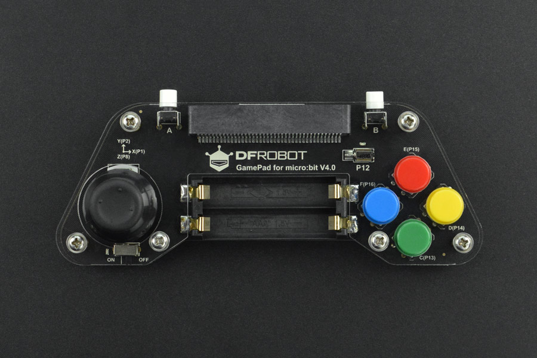

# DFRobot micro:GamePad V4 — MakeCode extension

A MakeCode extension for the **BBC micro:bit** and **DFRobot micro:GamePad V4**.

The extension provides ready-to-use blocks for buttons, the analog joystick, vibration, and the buzzer. It handles the low-level hardware details automatically, including pull-up configuration, active-low buttons, button debouncing, single-press detection, and joystick hysteresis.


Product page:

- https://www.dfrobot.com/product-1711.html
  



## Features

- C, D, E, and F buttons
- Joystick push button
- Analog joystick X/Y position
- Joystick direction detection
- Single-press button events
- Single-movement joystick events
- Adjustable vibration strength
- Timed vibration
- Buzzer tones
- English and Polish Visual Blocks

## Pin mapping

The extension is designed for the following DFRobot micro:GamePad V4 pin layout:

| Function | micro:bit pin |
|---|---|
| Button C | P13 |
| Button D | P14 |
| Button E | P15 |
| Button F | P16 |
| Joystick button | P8 |
| Joystick X | P1 |
| Joystick Y | P2 |
| Vibration motor + LED | P12 |
| Buzzer | P0 |

You do not need to configure these pins manually.

Button inputs are active LOW and the extension automatically enables the required pull-up resistors.

## Installing the extension

To add the extension to MakeCode:

1. Open [Microsoft MakeCode for micro:bit](https://makecode.microbit.org/).
2. Create or open a project.
3. Select **Extensions**.
4. Paste the GitHub repository URL into the search field.
5. Select the extension from the results.

A new **GamePad V4** category will appear in the Blocks toolbox.

## Button events

For most games, use the button pressed event:

```typescript
gamepadV4.onButtonPressed(gamepadV4.Button.C, function () {
    bird.change(LedSpriteProperty.Y, -1)
})

gamepadV4.onButtonPressed(gamepadV4.Button.E, function () {
    bird.change(LedSpriteProperty.Y, 1)
})
```

The event runs once for each physical button press.

You do not need to implement your own `old_up`, `old_down`, debounce logic, or `pause(100)` delays.

You can also check whether a button is currently being held:

```typescript
if (gamepadV4.isPressed(gamepadV4.Button.C)) {
    // Button C is currently held down
}
```

## Joystick events

The joystick can generate direction events:

```typescript
gamepadV4.onJoystick(gamepadV4.Direction.Up, function () {
    bird.change(LedSpriteProperty.Y, -1)
})

gamepadV4.onJoystick(gamepadV4.Direction.Down, function () {
    bird.change(LedSpriteProperty.Y, 1)
})
```

A direction event is generated when the joystick enters that direction.

To trigger the same direction again, return the joystick toward the center and move it again.

This makes joystick controls suitable for games where one movement should produce exactly one action.

## Reading joystick position

You can also read the raw analog joystick values:

```typescript
let x = gamepadV4.joystickX()
let y = gamepadV4.joystickY()
```

The values are in the approximate range:

```text
0 .. 1023
```

The center position is typically near the middle of the range.

You can also get the currently detected direction:

```typescript
let direction = gamepadV4.joystickDirection()
```

## Vibration

Start the vibration motor with a selected strength:

```typescript
gamepadV4.setVibrationStrength(300)
```

The strength range is:

```text
0 .. 1023
```

where:

- `0` — off
- lower values — weaker vibration
- `1023` — maximum output

To vibrate for a specified amount of time:

```typescript
gamepadV4.vibrate(300, 200)
```

This example uses strength `300` for `200 ms`.

To stop the motor:

```typescript
gamepadV4.stopVibration()
```

### Vibration LED

On the DFRobot micro:GamePad V4, pin P12 controls both the vibration motor and the onboard LED.

As a result, changing the vibration strength also changes the brightness of this LED.

## Buzzer

The onboard buzzer is connected to P0.

For example:

```typescript
gamepadV4.beep(440, 100)
```

This plays a `440 Hz` tone for `100 ms`.

## Joystick thresholds

The extension uses sensible default thresholds for direction detection:

```text
Up / Left threshold:    300
Down / Right threshold: 700
Center hysteresis:      400 / 600
```

The hysteresis prevents the joystick from rapidly switching between states when its analog value is close to a threshold.

For most projects, the defaults should work without any configuration.

If necessary, advanced users can change the thresholds using the `set joystick thresholds` block.

## Blocks and JavaScript

The extension can be used both with MakeCode Visual Blocks and JavaScript/TypeScript.

Typical blocks include:

- `on GamePad button ... pressed`
- `GamePad button ... is pressed`
- `on joystick moved ...`
- `joystick X`
- `joystick Y`
- `joystick direction`
- `set vibration strength ...`
- `vibrate with strength ... for ... ms`
- `stop vibration`
- `beep ... Hz for ... ms`

## Polish language support

Polish translations are included for Visual Blocks and help text.

When MakeCode is set to Polish, the extension automatically displays its supported block names and descriptions in Polish.

Translation files are located in:

```text
_locales/pl/dfrobot-gamepad-v4-strings.json
_locales/pl/dfrobot-gamepad-v4-jsdoc-strings.json
```

## Hardware compatibility

This extension is intended for the **DFRobot micro:GamePad V4** pin layout described above.

Other versions of the DFRobot gamepad may use different pin assignments and may not work correctly with this extension.

## License

MIT

